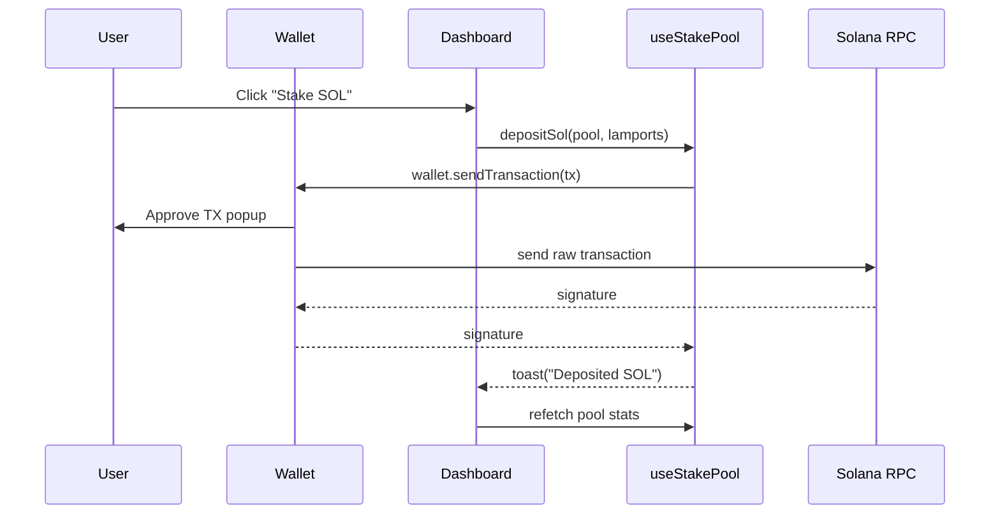

# Stake Pool Dashboard

> A production‑ready React front‑end for the **SPL Stake‑Pool** template generated with [Codigo.ai](https://codigo.ai). Connect any Solana wallet, view live pool stats and stake / unstake in seconds.

<p align="center">
  
</p>

---

## ✨ Features

- **Wallet‑agnostic** – Phantom, Solflare, Backpack, Ledger, … via `@solana/wallet‑adapter`.
- **Stake & Unstake SOL** – deposit SOL for pool tokens or burn tokens for native SOL.
- **Stake‑Account flows** – deposit existing delegated stake, withdraw as a fresh stake account.
- **Manager Panel** – add / remove validators, sync balances, view fees.
- **Responsive UI** – Tailwind CSS + shadcn‑ui components, dark‑mode ready.
- **Type‑safe hooks** – end‑to‑end `StakePoolApi` guarantees.

> **Live demo** coming soon – deploy to Netlify / Vercel in two clicks (see §11).

---

\## 1 · Prerequisites

| Requirement           | Version               | Why                               |
| --------------------- | --------------------- | --------------------------------- |
| **Node.js**           | 18 LTS or newer       | Needed for Vite & package scripts |
| **npm / pnpm / yarn** | npm ≥ 9 (or pnpm ≥ 8) | Package manager                   |
| **Solana wallet**     | Phantom, Solflare…    | To sign transactions              |

```bash
# Clone & bootstrap
git clone https://github.com/<your‑org>/<repo>.git
cd stake‑pool-dashboard
pnpm install               # or npm i / yarn

# Create .env.local (see §4)
cp .env.example .env.local  # fill in your pool address

# Run dev server
pnpm dev                    # http://localhost:5173
```

---

\## 2 · Tech Stack

| Layer       | Library / Tool                                             | Purpose                   |
| ----------- | ---------------------------------------------------------- | ------------------------- |
| **Build**   | Vite + ESBuild                                             | Ultra‑fast HMR            |
| **Runtime** | React 18 · TypeScript 5                                    | Component/UI logic        |
| **Styling** | Tailwind CSS · shadcn‑ui                                   | Design‑system & utilities |
| **Solana**  | @solana/web3.js · @solana/wallet‑adapter                   | Cluster RPC, wallet modal |
| **Pools**   | @solana/**spl‑stake‑pool** 1.1 · @solana/**spl‑token** 0.4 | Instruction builders      |
| **State**   | TanStack Query                                             | Caching & optimistic UI   |

---

\## 3 · Scripts

| Command     | Action                                             |
| ----------- | -------------------------------------------------- |
| `dev`       | Start Vite with HMR                                |
| `build`     | Create production build in `dist/`                 |
| `preview`   | Serve the build locally (for Netlify/Vercel tests) |
| `lint`      | ESLint (+ Prettier)                                |
| `typecheck` | Run `tsc --noEmit`                                 |

Run any with `pnpm <command>` (or `npm run …`).

---

\## 4 · Environment

> **Step‑by‑step setup**
>
> 1. Copy the sample file: `cp .env.example .env.local`
> 2. Open `.env.local` and fill in your values (below).
> 3. **Restart** `pnpm dev` so Vite picks up the changes.

```dotenv
###############################################
#  RPC / Cluster
###############################################
# devnet   → fast, free airdrops
# testnet  → semi‑stable, no fee bumps
# mainnet  → real money – double‑check keys!
VITE_RPC_ENDPOINT=https://api.devnet.solana.com

###############################################
#  Stake‑Pool Account
###############################################
# Public key of *the* stake‑pool account you want
# to interact with.  Example: JitoSOL on devnet
# J7T4YuF25YeobamGvkpWeiz8RmqD1C7YEYWA9Ewa7yS
VITE_STAKE_POOL_PROGRAM_ID=<replace_with_pool_pubkey>
```

| Variable                     | Example                               | Description & tips                                                                                                                 |
| ---------------------------- | ------------------------------------- | ---------------------------------------------------------------------------------------------------------------------------------- |
| `VITE_RPC_ENDPOINT`          | `https://api.mainnet-beta.solana.com` | Full RPC URL (`solana config get` shows yours). Use a paid node (Helius, QuickNode) for production to avoid rate‑limits.           |
| `VITE_STAKE_POOL_PROGRAM_ID` | `J7T4YuF25Ye…`                        | **Account** (not program‑executable) that stores pool state. Run `spl-stake-pool` CLI or `solana address -k <json>` to find yours. |

---

### 4.1 Upgrade the SDKs (one‑liner)

The hook expects **spl‑token 0.4+** & **spl‑stake‑pool 1.1+**. If you’re cloning fresh you’re good, otherwise:

```bash
pnpm add @solana/spl-token@latest @solana/spl-stake-pool@latest
```

\--- 5 · Folder Structure

```
src/
├── components/            # UI atoms & feature dialogs
├── hooks/
│   └── useStakePool.ts    # <— on‑chain logic (see §6)
├── contexts/              # WalletContext provider
├── pages/                 # Route components (dashboard  + 404)
├── App.tsx                # App shell & router
├── main.tsx               # Vite entrypoint
└── index.css              # Tailwind base
```

---

\## 6 · StakePool Hook Deep Dive

`useStakePool.ts` glues the UI to the on‑chain program. Key points:

1. **Single source of truth** – returns `loading` flag + strongly‑typed `StakePoolApi` helpers.
2. **Instruction helpers** – Uses SDK builders (`depositSol`, `withdrawStake`, …) so no manual PDA math.
3. **`sendAndConfirm` helper** – Wraps `wallet.sendTransaction()` then awaits `connection.confirmTransaction(sig, "confirmed")`.
4. **UX feedback** – Success & error toasts via custom `useToast()` hook.
5. **Version guard** – Works with **spl‑token 0.4.x** & **spl‑stake‑pool 1.1.x**. Upgrade with:

   ```bash
   pnpm add @solana/spl-token@latest @solana/spl-stake-pool@latest
   ```

<br>

---

\## 7 · Quick UI Flow



---

\## 8 · Local Validator (optional)

```bash
solana-test-validator -r  # wipe & start fresh
solana config set --url http://127.0.0.1:8899
# airdrop some SOL
solana airdrop 10
```

Update `VITE_RPC_ENDPOINT` to `http://127.0.0.1:8899` and you’re set.

---

\## 9 · Troubleshooting / FAQ

| Issue                                                      | Fix                                                                                       |
| ---------------------------------------------------------- | ----------------------------------------------------------------------------------------- |
| **TypeScript mismatch** on `getAssociatedTokenAddressSync` | Run `pnpm add @solana/spl-token@^0.4`                                                     |
| Wallet dialog never appears                                | Make sure browser pop‑ups aren’t blocked & wallet adapter autoConnect is disabled in dev. |
| `Transaction was not confirmed`                            | Use a faster RPC node (Helius, Triton) or set `commitment: "processed"` while debugging.  |

---

\## 10 · Deployment Guides

### Vercel

```bash
vercel --prod                     # first run will prompt env vars
```

### Netlify

```bash
netlify init                      # select “build command = pnpm build”, publish = dist/
netlify deploy --prod
```

### Cloudflare Pages

```bash
wrangler pages deploy dist
```

---

\## 11 · Contributing

1. Fork → `git clone` → create feature branch.
2. Run `pnpm lint && pnpm typecheck` before committing.
3. Use [Conventional Commits](https://www.conventionalcommits.org/) (`feat: …`, `fix: …`).

PRs welcome! Open issues for bugs, enhancements, or docs.

---

\## 12 · License & Credits

- Code: **MIT** © 2025 **Andy Luemba**
- Built with ❤️ on top of Solana, Codigo.ai and the SPL Stake‑Pool program.
